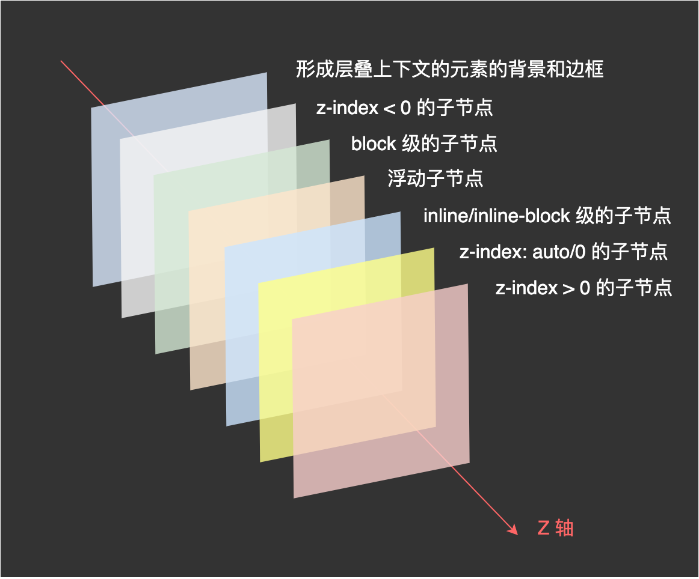

#### css相关的知识
- [css面试相关](https://juejin.cn/post/6876625311988088840)
+ 学习笔记
   1. css盒模型
      + css盒模型分为 content、padding、border、margin四部分，又有两种盒模型，通过 box-sizing 切换
   2. 伪类和伪元素的区别
      + 其中伪类用单冒号表示，当元素处于某种状态时，为该元素添加样式，如 a 标签的 hover；
      + 伪元素用双冒号表示，为了兼容老浏览器，有时候也会用单冒号表示，作用是创建不在文本流中的元素，并为其添加样式，如 ::before，在指定元素前添加元素
   3. BFC
      + BFC的中文名称是块级格式化上下文，具有BFC特性的元素可以看出一个独立的隔离容器，里面的元素不会影响外面的于啊啊怒视。
      + 什么时候需要用到BFC
         1. 父子元素margin重叠问题
         2. 相邻元素垂直外边距折叠问题
         3. 浮动元素造成父元素高度塌陷问题
         4. 浮动元素和不浮动元素界限不清，重叠
      + 触发BFC的方式
         1. 根元素
         2. 浮动元素
         3. 绝对定位的元素(position为absolute或fixed)
         4. display inline-block/table-cell/flex
         5. overflow不为visible的值
##### import和link导入css的区别
   + import导入的样式需要页面加载完成后再加载，link导入样式会在页面加同时加载。
   + link是html标签，没有兼容性问题，但是import不兼容ie5以下
+ 文档流：
   + 文档流就像流水一样，能够自适应所在的容器，一般有以下几个特性：
      1. 块级元素会占满整行，所以多个块级盒子之间是从上到下排列的。
      2. 内联元素会在一行里面一列一列的排布，当一行放不下的时候，会自动切换到下一行继续按照列排布
   + 脱离文档流： 在正常文档中的其他节点将忽略该节点并填补其原先空间。不占据空间。
      + 脱离文档流有两种方式
         1. 浮动
         2. 绝对定位或者固定定位
+ 视觉格式化模型：用来处理再实觉媒体上显示文档时使用的计算规则。
   + 盒子类型由display决定
      1. outer display type: 决定该元素本身如何布局，即参入何种格式化上下文
         + 块级盒子(block-level-box)：
            + block list-item table flex grid flow-root
            
         + 行内盒子（inline-level-box）
            + inline inline-block inline-table
      2. inner display type: 把元素当作容器，规定内部子元素是如何布局的。
         + 对内display 
            + block container 建立BFC或者IFC
            + flex container 建立FFC
            + grid container 建立GFC
      + BFC 块级格式化上下文，是一个独立的渲染区域，只有块级盒子参与。
         + BFC渲染规则： 
            1. 内部的盒子会在垂直方向，一个接一个地放置
            2. 盒子垂直方向的距离由margin决定，属于同一个BFC的两个相邻盒子的margin会发生重叠
            3. 每个元素的margin的左边，与包含块border左边相接触
            4. bfc区域不会与float盒子重叠
            5. bfc是页面的一个隔离的独立容器，容器里面的子元素不会影响到外面的元素，反之如此
            6. 计算bfc高度时，浮动元素也参与计算
         + BFC的应用
            1. 自适应的两栏布局
               + 原理：BFC区域不会和浮动区域重叠，所以可以把侧边栏固定宽度且左浮动，而右侧内容触发bfc，使得它的宽度自适应行剩余宽度。
            2. 清楚内部浮动
               + 原理：计算bfc的高度时，浮动元素也能参与计算。
            3. 防止margin重叠
               + 同一个BFC下的垂直margin会发生合并。
      + IFC ifc形成条件非常简单，块级元素中仅包含内联级别元素，
      + ifc的渲染规则
         1. 水平方向一个接一个排列，
         2. 节点无法声明宽高，其中margin和padding在水平方向有效在垂直方向无效
         3. 当内联级盒子的总宽度少于包含他们的line box时，其水平渲染规则由text-align属性值来决定
+ 层叠上下文
   + z-index 能够在层叠上下文中对元素的堆叠顺序其作用是必须配合定位才可以
   + 符合以下任一条件的元素会产生层叠上下文
      1. html文档根元素
      2. position absolute或者relative且z-index不为auto的元素
      3. 声明position为fixed或者sticky的元素
      4. flex的子元素，且z-index不为auto
      5. grid的子元素，且z-index不为auto
      6. opacity小于1的元素
      7. transform filter perspective clip-path mask 不为none的元素
      
+ 单位
   + px px表示的是css中的像素，在css中它是绝对的长度单位，也是最基础的单位，其他长度单位会自动被浏览器换算成px,
   + 设备像素： 设备屏幕的物理像素，表示屏幕的横纵有多少像素点。和屏幕分辨率差不多
   + 设备像素比（dpr）： 设备像素比是指1个css像素等于几个物理像素 dpr = 物理像素/逻辑像素数
   + 像素密度（dpi） 屏幕对角线的像素尺寸/物理尺寸
   + 设备独立像素（dip）：
   1. em css中的相对单位
      + 在font-size中使用是相对于父元素的font-size大小
      + 在其他属性中使用是相对于自身的字体大小
   2. rem rem是相对于html的根元素的font-size来计算的。
   3. vw vh
+ 颜色
   1. 颜色关键字： 不区分大小写的标识符
   2. transparent
   3. currentColoe 会取当前元素继承父级元素的文本颜色值
   4. rgba
   5. 十六进制符号 00-ff
+ 自定义属性
   + 自定义属性也和普通属性一样有级联性，申明在:root下的时候，在全文档范围内可用，而如果在某个元素下申明自定义属性，则只能在它及它的子元素下才可以使用。
   + 自定义属性必须通过--x的格式申明，使用自定义属性的时候
+ 清楚浮动
   + 浮动元素会脱离文档流向左/向右浮动，直到碰到父元素或者另外一个浮动元素
   + 浮动产生的影响
      + 如果一个元素的子元素都是浮动的，那这个父元素将失去高度。
   + 清楚浮动的方法
      1. BFC : overflow:hidden
      2. clear 
         ```+ ::after{
            content:'';
            clear: both
            display: block;
         }
         ```
+ 清除浏览器的默认样式
   1. 之前采用的是reset.css
   2. 现在更加推荐使用normalize.css
   + 原因
      1. reset.css几乎为所有的标签都设置了more样式，而normalize.css则有选择性保护了部分有价值的默认值
      2. 修复了很多浏览器的bug
      3. 不会让调试工具变得杂乱
+ 整块文本溢出省略特性探究
   1. 单行文本省略
      ```
        text-overflow: ellipsis;
        overflow:hidden;
        white-space: no-wrap;
      ```
   2. 多行文本溢出
      ```
        overflow:hidden;
        text-overflow:ellipsis;
        display:-webkit-box;
        -webkit-line-clamp:2;
        -webkit-orient:vertical;
      ```
   3. 整块文本溢出
      ```
        white-space:no-wrap;
        overflow:hidden;
        text-overflow:ellipsis;
        display:-webkit-box;
        -webkit-line-clamp:1;
        -webkit-orient:vertical;

        span display:inline-block
      ```
+ 居中问题
   1. 单行文本 inline或者是inline-block;
      + 水平居中：text-align:center
      + 垂直居中:
         1. 上下padding
         2. height + line-height
   2. 固定宽高的块级盒子
      1. absolute + 负的margin
      2. absolute + margin auto
      3. absolute + calc
   3. 不固定宽高的块级盒子
      1. absolute + transform
      2. line-height + vertical-align
      3. writing-mode 三层盒子：第一层是垂直居中，第二层设置水平居中
      4. css-table 可以让我们把普通元素，变成table元素 
      5. flex
      6. grid
+ 两栏布局
   1. float + overflow
   2. float + margin
   3. flex
+ 三栏布局
   1. 圣杯布局 main模块的宽度是百分之百
   2. 双飞翼布局 main里面有个
   3. flex布局
+ 多列等高布局
   1. 利用 margin 和 padding 对冲实现

   