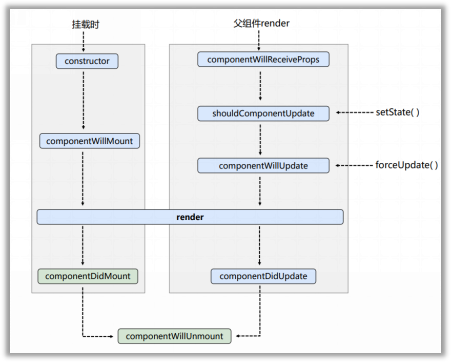
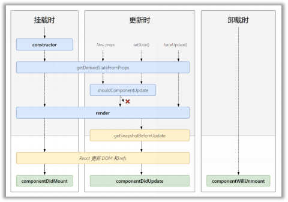

###### JSX
+ react定义的一种类似于xml的js扩展语法JSX+XML
+ 作用是用来简化创建虚拟Dom
+ 标签名任意，属性任意
###### 模块的作用：复用js简化js的编写，提高js运行效率
###### 组件的作用：复用编码，简化项目编码，提高运行效率
+ 注意事项：
   1. 组件名必须首字母大写
   2. 虚拟DOM元素只能一个根元素
   3. 虚拟Dom元素必须有结束标签
#### 组件的三大核心属性
###### state
+ state是组件对象最重要的属性，值是对象
+ 组件被称为‘状态机’，通过更新组件的state来更新对应的页面显示。
+ 注意事项：
   1. 组件中render方法中的this为组件实例对象
   2. 组件自定义的方法中this为undefined
      + 强制绑定this
      + 箭头函数
   3. 状态数据，不能直接修改或者更新
###### props
   + 每个组件对象都会有props属性
   + 组件标签的所有属性都保存在props中
   + 通过props从组件外向组件内传递变化的数据
   + 组件内部不要修改props数据
###### refs与事件处理
   + 字符串形式的ref
   ```
     <input ref = 'input1' />
   ```
   + 回调形式的ref
   ```
     <input ref = {(c) => {this.input1 = c}}>
   ```
   + createRef创建的ref容器
   myRef = React.createRef();
   ###### 事件处理
      + react使用的是自定义事件，而不是使用原生Dom事件
      + react中的事件是通过事件委托方式处理的
      + 通过event.target得到发生事件的Dom元素
    
    
     