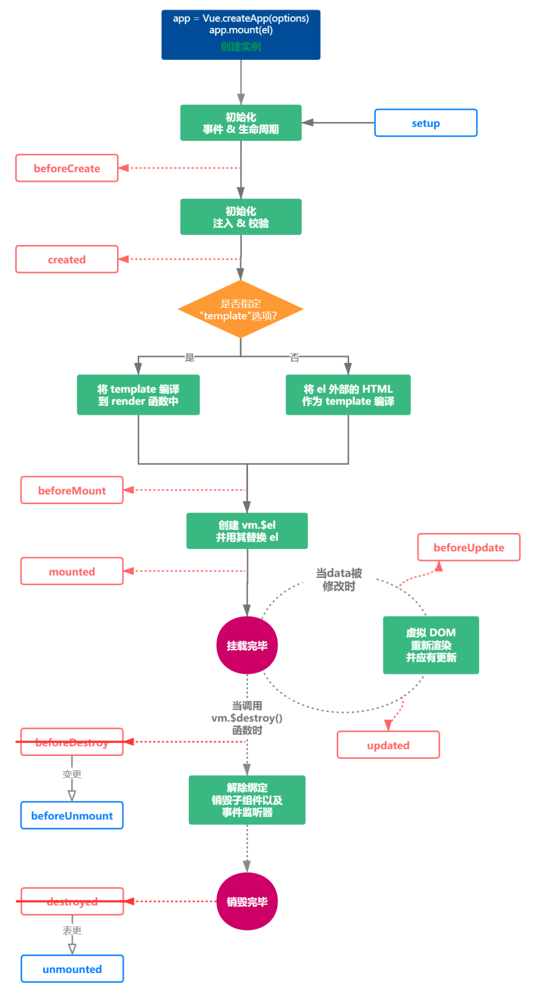

#### 为什么要升级vue3
   + vue2.x中当我们要实现某个需求的时候，就要在data,methods,computed以及mounted中反复跳转。不够清晰，代码的可读性和可维护性都不高。
   + vue3.x就推出了component Api,将零散分布的逻辑组合在一起来维护，并且还可以将单独的功能逻辑分成单独的文件。
###### setup的时机
   + setUp的时机是早于beforeCreate
   + setUP的参数 props context
       + props
          1. 由于props是响应式的，会及时本更新，所以不可以使用解构，解构会消除他的响应式。
       + context
          + context中提供了三个属性 attrs slot emit这三个属性都是自动同步最新的值。
###### reactive ref  toRefs
   + ref既可以处理对象类型也可以处理基础类型
   + reactive不能代理基本类型
   + toRefs用于将一个reactive对象转化为属性全部为ref对象的普通对象

   + 从图中我们可以看到vue3.0新增了setup,然后vue2中的beforeDestory名称变更成beforeUnmount destory变更成unmount。
###### watch和watchEffect的用法
   + watch函数用来侦听特定数据源，并在回调函数中执行副作用。默认情况下是惰性的，也就是说仅在侦听的源数据变更时才执行回调
   + watch是惰性的，什么情况下不是惰性的，可以立即执行回到函数呢，给第三个参数中设置immediate:true即可。
   + stop停止监听，watch会在组件销毁时自动停止，如果在组件销毁之前我们想要停止掉某个监听，可以调用watch函数的返回值。
   + watchEffet会自动收集依赖，只要指定一个回调函数，在组建初始化时，会先执行一次手机依赖，然后当收集到的以来数据发生变化时，就会再次执行回调函数
   + watch 和 watchEffect的对比
      1. watchEffect不需要手动传入依赖
      2. watchEffectz会执行一次用来自动收集依赖
      3. watchEffect无法获取变化之前的值，智能获取变化后的值。
###### vue3.x和vue2.x响应式
   + vue3.x将使用proxy取代vue.x版本的object.defineProperty 
      1. object.defineProperty智能劫持对象属性，而proxy是直接代理对象
      2. object.defineProperty对新增属性需要手动进项Observe $set
###### teleport
   + 我们想设计一个独立的组年，从dom结构应该完全剥离vue顶层组件挂载到dom，同时还可以使用到vue组件内的状态，简单的来说就是，既希望在组件内部使用dialog，又希望渲染的dom结构不嵌套在组件的dom中。此时我们的teleport上场。
###### suspend
   + suspend时一个带插槽的组件，只是它的插槽指定了default和callback两种状态。
###### 更好的tree-shaking
   + 表现为限制的全局Api需要通过es module的引入方式进行具名引用 
   + 受影响的api又
      1. nextTick
      2. observable
      3. version
      4. compile
      5. set
      6. delete
